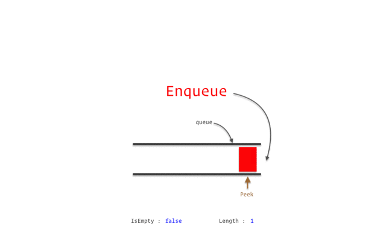
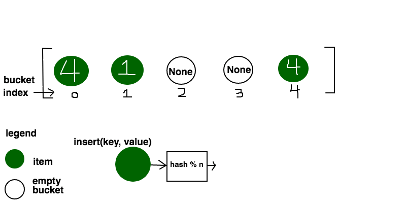

# Data Structures [](https://github.com/ParthPathak27/Data-Structures/blob/master/LICENSE)  [](https://www.linkedin.com/in/parth-pathak-learner/)
Stack, Queue, Linked List, Binary Search Tree & Hashing

This code helps you to understand the different Data structures. The data structures depicted in this code are:

1. Stack
2. Queue
3. Linked List
4. Binary Search Tree
5. Hash Table: Linear Probing & Quadratic Probing

### Sourcerer [](https://sourcerer.io/fame/ParthPathak27/ParthPathak27/Data-Structures/links/0)[](https://sourcerer.io/fame/ParthPathak27/ParthPathak27/Data-Structures/links/1)[](https://sourcerer.io/fame/ParthPathak27/ParthPathak27/Data-Structures/links/2)[](https://sourcerer.io/fame/ParthPathak27/ParthPathak27/Data-Structures/links/3)[](https://sourcerer.io/fame/ParthPathak27/ParthPathak27/Data-Structures/links/4)[](https://sourcerer.io/fame/ParthPathak27/ParthPathak27/Data-Structures/links/5)[](https://sourcerer.io/fame/ParthPathak27/ParthPathak27/Data-Structures/links/6)[](https://sourcerer.io/fame/ParthPathak27/ParthPathak27/Data-Structures/links/7)

### Code Requirements
The example code is in C ([version 3.2](https://archive.codeplex.com/?p=turboc) or higher will work).

### Description
In computer science, a data structure is a data organization, management, and storage format that enables efficient access and modification. More precisely, a data structure is a collection of data values, the relationships among them, and the functions or operations that can be applied to the data.

For more information, [see](https://en.wikipedia.org/wiki/Data_structure)

## Stack

```c
switch(ch)
        {
            case 1:
                printf("Enter the element to be pushed::");
                scanf("%d",&value);
                push(value);
                getch();
                break;
            case 2:
                value=pop();
                printf("The poped element is::%d",value);
                getch();
                break;
            case 3:
                printf("Enter the element to be searched::");
                scanf("%d",&value);
                peep(value);
                getch();
                break;
            case 4:
                printf("Enter the element to be updated::");
                scanf("%d",&value);
                printf("Enter new value::");
                scanf("%d",&new_ele);
                change(value,new_ele);
                getch();
                break;
            case 5:
                display();
                getch();
                break;
            case 6:
                exit(0);
            default:
                printf("Invalid choice");
                getch();
                break;
        }
```        
## Queue

```c
switch(ch)
        {
            case 1:
                printf("Enter the element to be inserted::");
                scanf("%d",&value);
                insert(value);
                getch();
                break;
            case 2:
                value=remove1();
                printf("The removed element is::%d",value);
                getch();
                break;
            case 3:
                printf("Enter the element to be searched::");
                scanf("%d",&value);
                search(value);
                getch();
                break;
            case 4:
                printf("Enter the element to be updated::");
                scanf("%d",&value);
                printf("Enter new value::");
                scanf("%d",&new_ele);
                update(value,new_ele);
                getch();
                break;
            case 5:
                display();
                getch();
                break;
            case 6:
                exit(0);
            default:
                printf("Invalid choice");
                getch();
                break;
        }
```
## Linked List


```c
switch(ch)
        {
            case 1:
                if(flag==0)
                {
                    flag=1;
                    create();
                }
                else
                {
                    printf("\nLinked list is already created
                    if you want then press 13");
                }
                getch();
                break;
            case 2:
                display();
                getch();
                break;
            case 3:
                insert_begining_singly_ll();
                getch();
                break;
            case 4:
                insert_end_singly_ll();
                getch();
                break;
            case 5:
                insert_after_desirednode_singly_ll();
                getch();
                break;
            case 6:
                insert_after_desiredposition_singly_ll();
                getch();
                break;
            case 7:
                delete_first_singly_ll();
                getch();
                break;
            case 8:
                delete_last_singly_ll();
                getch();
                break;
            case 9:
                delete_desired_node_singly_ll();
                getch();
                break;
            case 10:
                delete_before_desired_position_singly_ll();
                getch();
                break;
            case 11:
                delete_after_desired_position_singly_ll();
                getch();
                break;
            case 12:
                delete_desired_position_singly_ll();
                getch();
                break;
            case 13:
                create();
                getch();
                break;
            case 14:
                ascendingSort();
                getch();
                break;
            case 15:
                printf("Maximum number is %d",maximum());
                getch();
                break;
            case 16:
                exit(0);
            default:
                printf("Invalid choice");
                getch();
                break;
        }
```
## Binary Search Tree (BST)

```c
switch(ch)
        {
            case 1:
                create();
                getch();
                break;
            case 2:
                preorder(root);
                getch();
                break;
            case 3:
                inorder(root);
                getch();
                break;
            case 4:
                postorder(root);
                getch();
                break;
            case 5:
                exit(0);
            default:
                printf("Invalid choice");
                getch();
                break;
        }
```
## Hashing

